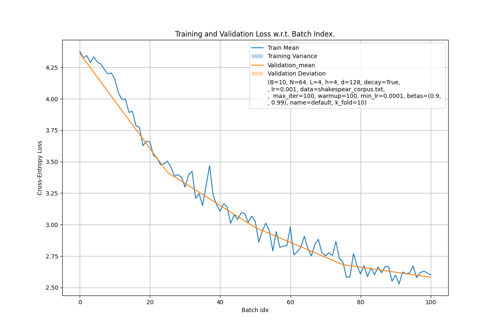

# Shakespeak

Toy Transformer implementation trained on character level tokens on Shakesperian and Children stories text.

## Basic Usage

Training a model is done by instanciating a `Training` object with an object containing all model hyperparameters,
paths, names. 

```python
args = Args()                                   # see Args object for default parameters
args.name = 'default'
args.save_int = 30                              # save every 30 iterations
args.max_iter = 100
args.val_int = 25                               # compute validation loss every 25 grad steps
args.save = True

print("Default arguments : \n--------------------------\n", 
      args, '\n--------------------------')

train = Training(args)                          # training run takes a bag of parameters 
default_model, def_train_loss, def_valid_loss = train.train()

cv_losses_graph(
    def_train_loss.unsqueeze(0), def_valid_loss.unsqueeze(0), 
    args.val_int, path="./runs/default/", save=True, name=args.name, 
    args=args.__dict__)
```


## Command Line Interface

```
usage: train.py [-h] [--batch_size BATCH_SIZE] [--n_tokens N_TOKENS] [--n_layers N_LAYERS] [--n_heads N_HEADS] [--d_model D_MODEL] [--lr LR]
                [--use_lr_decay USE_LR_DECAY] [--lr_decay_iter LR_DECAY_ITER] [--dataset_path DATASET_PATH] [--max_iter MAX_ITER] [--betas [BETAS]]
                [--n_epochs [N_EPOCHS]] [--n_warm_iters [N_WARM_ITERS]] [--min_lr [MIN_LR]] [--n_validation_batch [N_VALIDATION_BATCH]]
                [--val_int [VAL_INT]] [--out_dir [OUT_DIR]] [--name [NAME]] [--save_int [SAVE_INT]] [--save [SAVE]] [--cross_val [CROSS_VAL]]
                [--k_fold [K_FOLD]]

options:
  -h, --help            show this help message and exit
  --batch_size BATCH_SIZE, -b BATCH_SIZE
                        Batch size (default: 10).
  --n_tokens N_TOKENS, -N N_TOKENS
                        Number of tokens (default: 64).
  --n_layers N_LAYERS, -L N_LAYERS
                        Number of layers (default: 4).
  --n_heads N_HEADS     Number of heads (default: 4).
  --d_model D_MODEL, -d D_MODEL
                        Dimension of model (default: 128).
  --lr LR, -lr LR       Learning Rate (default: 0.001).
  --use_lr_decay USE_LR_DECAY
                        Use learning rate decay strategy (default: True).
  --lr_decay_iter LR_DECAY_ITER
                        No of iter during which lr will decay (default: 5000).
  --dataset_path DATASET_PATH
                        Dataset file to use for training (default: ../datasets/shakespear_corpus.txt).
  --max_iter MAX_ITER   Maximum Number of iterations for training (default: 100).
  --betas [BETAS]       Adam moving average beta1, beta2 (default: (0.9, 0.99)).
  --n_epochs [N_EPOCHS]
                        Number of times to iterate on dataset (default: 10).
  --n_warm_iters [N_WARM_ITERS]
                        Number of warmup iterations of lr schedule (default: 100).
  --min_lr [MIN_LR]     Minimum lr value (default: 0.0001).
  --n_validation_batch [N_VALIDATION_BATCH]
                        Batch size of validation loss computation (default: 200).
  --val_int [VAL_INT]   Interval of iters to pass before computing val loss (default: 100).
  --out_dir [OUT_DIR]   Directory containing the saved models (default: ./runs/).
  --name [NAME]         Name of the model / run (default: milkshake).
  --save_int [SAVE_INT]
                        No of ints before saving model state to file. BEWARE ! Large models can be HUNDREDS OF MEGABYTES large, so saving every 10
                        iterations will fill your drive. (default: 200).
  --save [SAVE]         Wether to save the model every save_int steps (default: True).
  --cross_val [CROSS_VAL]
                        Run cross-validation (default: False).
  --k_fold [K_FOLD]     Number of k-folds (default: 10).
```

A folder will be created where checkpoints will be saved every `val_int` as long as `--save=True` and `save_int < max_iter`. 
These checkpoints can be reloaded with `load_model_metrics()`, see `notebooks/usage_examples.ipynb` for a working example.

### Launching a cross-validation run

```
python3 ./train.py --batch_size=12 --n_tokens=64 --n_layers=2 --n_heads=2 --d_model=32 --use_lr_decay=True --dataset_path='./datasets/shakespear_corpus.txt' --max_iter=200 --val_int=25 --cross_val=True --k_fold=10 --save=True --save_int=50 --name=YvanTest
```


### Unit Tests

From Bash, run 
```bash
for f in ./test/*.py; do python3 "$f"; done
```